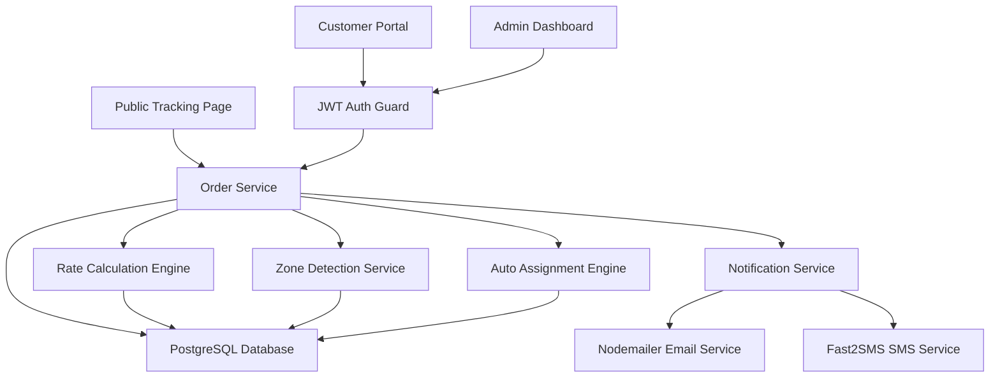

# 🚚 Last-Mile Delivery Tracker

A production-ready full-stack delivery management platform featuring a dynamic rate calculation engine, intelligent agent auto-assignment, immutable tracking history, and multi-city zone coverage.

**Tech Stack:** React (Vite) + Node.js (Express) + PostgreSQL + Prisma ORM + Nodemailer + Fast2SMS

---

## 🌐 Live Deployment & Demo

- **Frontend Application**: `https://lastmiledelivery-frontend-static.onrender.com`

- **System Design Document**: [`system-design.md`](file:///c:/Users/kalin/LastMileDelivery/system-design.md)

---

## 📋 Table of Contents
- [Features](#-features)
- [Architecture](#-architecture)
- [City & Zone Coverage](#-city--zone-coverage)
- [Setup Guide](#-setup-guide)
- [Database Schema](#-database-schema)
- [API Documentation](#-api-documentation)
- [Rate Calculation Logic](#-rate-calculation-logic)
- [Environment Variables](#-environment-variables)

---

## ✨ Features

### Customer Portal
- **Dark Landing Page**: Modern glassmorphic hero page with interactive feature highlights.
- **Order Booking Flow**: Structured address input (Line 1, Area, City, Pincode) with auto-zone lookup on blur.
- **Speed & Rate Options**: Instant price breakdown across delivery speed tiers (*Standard*, *Express*, *Same-Day*).
- **Public & Authenticated Tracking**: Immutable milestone tracking timeline viewable via direct URL (`/track/:id`) without login requirement.
- **Reschedule Flow**: Customer portal enables easy rescheduling for failed delivery attempts.

### Admin Dashboard
- **Coverage & Zone Management**: Configure city zones and map 6-digit pincodes.
- **Dynamic Rate Cards**: Set intra-zone, inter-zone, B2B, and B2C rates per KG with minimum charge floors.
- **COD Surcharges**: Configure flat COD fees per order type.
- **Order Management & Auto-Assignment**: Overview charts, pending order queues, and one-click agent assignment.
- **Fleet Control**: Manage agent accounts, zone allocations, and availability toggles.

### Delivery Agent App
- **Assigned Queue**: View active orders assigned to the agent.
- **Status Updates**: Update order status (`Picked Up` → `In Transit` → `Out for Delivery` → `Delivered` / `Failed`).
- **Availability Toggle**: Switch operational status (`Available` / `Busy`).

---

## 🏗️ Architecture



### Directory Structure
```text
LastMileDelivery/
├── backend/              # Node.js + Express + Prisma ORM
│   ├── prisma/
│   │   ├── schema.prisma
│   │   ├── seed.js       # Seed users, initial zones & 192 rate cards
│   │   └── add_zones.js  # Add Bengaluru, Hyderabad & Vijayawada
│   ├── src/
│   │   ├── routes/       # Auth, orders, zones, areas, rate cards, agents
│   │   ├── services/     # Rate Engine, Zone Detector, Auto-Assign, Notifier
│   │   ├── middleware/   # JWT Auth & Role Guard
│   │   └── index.js
│   └── .env.example
├── frontend/             # React (Vite) SPA
│   ├── src/
│   │   ├── pages/        # Customer, Admin, Agent, TrackOrder, Landing, Auth
│   │   ├── context/      # AuthContext
│   │   └── lib/          # API Axios Client & Utilities
├── render.yaml           # Render Infrastructure Blueprint
└── system-design.md      # Detailed Architecture Write-Up & Mermaid Diagrams
```

---

## 🗺️ City & Zone Coverage

The system supports multi-city delivery networks seeded out-of-the-box:

| City | Zones | Sample Pincodes Mapped |
|---|---|---|
| **Mumbai** | North Mumbai, South Mumbai | `400066`, `400069`, `400001`, `400018` |
| **Thane & Navi Mumbai** | Thane, Navi Mumbai | `400601`, `400080`, `400703`, `410210` |
| **Pune** | Pune | `411005`, `411028`, `411038` |
| **Bengaluru** | Central, East, North | `560001`, `560066`, `560024`, `560100` |
| **Hyderabad** | Central, West | `500003`, `500016`, `500081`, `500032` |
| **Vijayawada** | Vijayawada | `520010`, `520002`, `520001`, `520007` |

---

## 🚀 Setup Guide

### Prerequisites
- Node.js >= 18
- PostgreSQL Database

### 1. Clone & Install Dependencies
```bash
# Install backend dependencies
cd backend
npm install

# Install frontend dependencies
cd ../frontend
npm install
```

### 2. Configure Environment Variables
```bash
cp backend/.env.example backend/.env
```

### 3. Initialize & Seed Database
```bash
cd backend
npx prisma migrate dev --name init
node src/prisma/seed.js
node src/prisma/add_zones.js
```

### 4. Start Development Servers
```bash
# Backend (Port 5000)
cd backend
npm run dev

# Frontend (Port 5173)
cd frontend
npm run dev
```

Open [http://localhost:5173](http://localhost:5173) in your browser.

### Default Seed Credentials
| Role | Email | Password |
|---|---|---|
| **Admin** | `admin@lastmile.com` | `admin123` |
| **Customer** | `customer@test.com` | `customer123` |
| **Agent 1** | `agent1@lastmile.com` | `agent123` |
| **Agent 2** | `agent2@lastmile.com` | `agent123` |

---

## 🗄️ Database Schema

- `users` $\rightarrow$ `id, name, email, phone, password_hash, role (CUSTOMER|AGENT|ADMIN)`
- `agent_profiles` $\rightarrow$ `id, user_id, zone_id, is_available`
- `zones` $\rightarrow$ `id, name`
- `areas` $\rightarrow$ `id, name, pincode (UNIQUE), zone_id`
- `rate_cards` $\rightarrow$ `id, zone_from_id, zone_to_id, order_type (B2B|B2C), rate_per_kg, min_charge`
- `cod_surcharges` $\rightarrow$ `id, order_type (UNIQUE), surcharge_flat`
- `orders` $\rightarrow$ `id, customer_id, agent_id, pickup/drop details, weight, volumetric_weight, billable_weight, charges, status, scheduled_date`
- `tracking_history` $\rightarrow$ `id, order_id, status, changed_by_id, changed_by_role, note, timestamp` *(Append-Only)*
- `reschedule_requests` $\rightarrow$ `id, order_id, new_date, requested_at`

---

## 📡 API Documentation

### Auth
| Method | Endpoint | Access | Description |
|---|---|---|---|
| POST | `/api/auth/register` | Public | Register new customer |
| POST | `/api/auth/login` | Public | Authenticate user (all roles) |
| GET | `/api/auth/me` | Bearer | Fetch current user profile |

### Orders & Tracking
| Method | Endpoint | Access | Description |
|---|---|---|---|
| POST | `/api/orders/calculate` | Public | Calculate rate options without placing order |
| POST | `/api/orders` | Auth | Create order |
| GET | `/api/orders` | Auth | List orders (filtered by role) |
| GET | `/api/orders/:id` | Auth | Get order details & tracking history |
| GET | `/api/orders/:id/track` | Public | Safe public tracking endpoint (no auth/PII) |
| POST | `/api/orders/:id/auto-assign` | Admin | Auto-assign nearest available agent |
| POST | `/api/orders/:id/assign` | Admin | Manually assign agent |
| PATCH | `/api/orders/:id/status` | Agent/Admin | Update order status (appends audit log) |
| POST | `/api/orders/:id/reschedule` | Customer/Admin | Reschedule failed delivery |

### Zones & Areas
| Method | Endpoint | Access | Description |
|---|---|---|---|
| GET | `/api/zones` | Public | List all zones |
| POST | `/api/zones` | Admin | Create new zone |
| PUT | `/api/zones/:id` | Admin | Update zone name |
| DELETE | `/api/zones/:id` | Admin | Remove zone |
| GET | `/api/areas` | Public | List all mapped areas |
| GET | `/api/areas/lookup/:pincode` | Public | Resolve pincode to zone |
| POST | `/api/areas` | Admin | Map new pincode to zone |

---

## 💰 Rate Calculation Logic

```text
INPUT: pickupPincode, dropPincode, L, B, H, actualWeight, orderType, paymentType, rateType

STEP 1: Pincode → Zone Lookup
  areas table: WHERE pincode = pickupPincode → pickup_zone_id
  areas table: WHERE pincode = dropPincode   → drop_zone_id

STEP 2: Volumetric & Billable Weight
  volumetric_weight = (L × B × H) / 5000
  billable_weight = MAX(actual_weight, volumetric_weight)

STEP 3: Base Charge Calculation
  rate_cards: WHERE zone_from_id = pickup_zone AND zone_to_id = drop_zone AND order_type = orderType
  raw_charge = billable_weight × rate_per_kg
  base_charge = MAX(raw_charge, min_charge)

STEP 4: Speed Tier Adjustment
  - Standard: base_charge × 1.0
  - Express: base_charge × 1.3
  - Same-Day: base_charge × 1.6

STEP 5: COD Surcharge & Total
  cod_surcharges: WHERE order_type = B2B|B2C → surcharge_flat (if COD)
  total_charge = base_charge + cod_surcharge
```

---

## 🔔 Notifications & Communication

- **Email Dispatch**: Built with Nodemailer (HTML templates with direct tracking buttons).
- **SMS Integration**: Integrated with Fast2SMS API (`FAST2SMS_API_KEY`) for real-time mobile updates.
- **Asynchronous Execution**: Notification failures are non-blocking and non-fatal.
