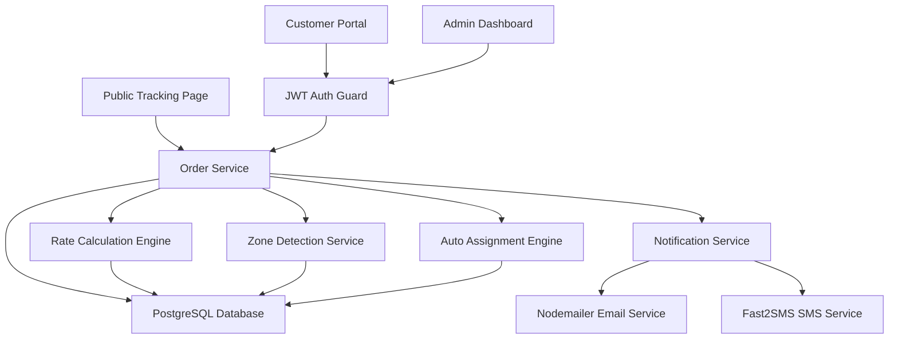
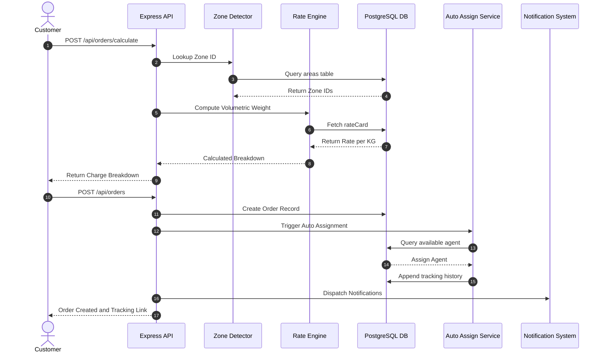
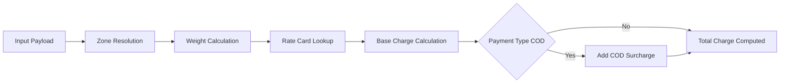
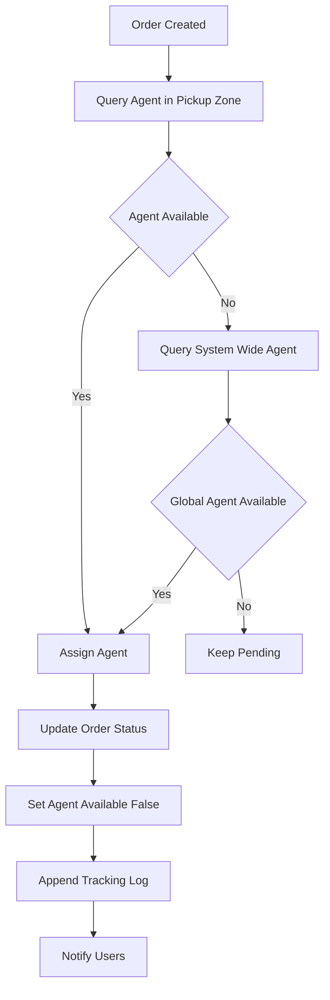
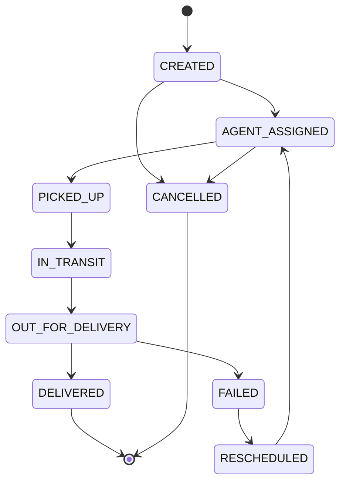

# System Design Write-Up: Last-Mile Delivery Tracker

## Overview

The Last-Mile Delivery Tracker platform manages configurable rate calculations, zone-based delivery routing, intelligent agent assignments, and immutable delivery lifecycles.

---

## 1. System Architecture & Component Interactions

The system adopts a modular REST architecture with a stateless API layer and an immutable relational data model.

---

## 2. Rate Calculation Engine

The rate engine operates as a sequential pipeline without hardcoded business rules. All pricing attributes reside in the database.

### Key Technical Aspects
- **Zone Detection**: Indexed lookup on pincodes via the `areas` table (O(1) query time).
- **Volumetric Weight**: Standard courier formula `(L × B × H) / 5000`. Billable weight is `MAX(actual_weight, volumetric_weight)`.
- **Rate Card Selection**: Deterministic database lookup using the composite key `(zone_from_id, zone_to_id, order_type)`.
- **COD Surcharge**: Applied per order type (`B2B` vs `B2C`) when payment type is `COD`.

---

## 3. Intelligent Auto-Assignment Logic

Agent assignment operates through an atomic database transaction using a 2-tier fallback model.

---

## 4. Order Status Lifecycle & Immutable Audit History

All status transitions are tracked in an append-only `tracking_history` table. Existing tracking entries are never updated or deleted.

### Immutable Tracking Record Schema
Each transition appends a record with:
- `order_id`: Target order identifier.
- `status`: New lifecycle state.
- `changed_by_role`: Actor role (`CUSTOMER`, `AGENT`, `ADMIN`, `SYSTEM`).
- `note`: Operational log or reason for failure/reschedule.
- `timestamp`: Server-generated timestamp.

---

## 5. Technology Stack Summary

| Layer | Component | Description / Rationale |
|---|---|---|
| **Frontend** | React (Vite) | Single Page Application with real-time UI states |
| **Backend** | Node.js / Express | Modular REST API with role-based JWT auth |
| **Database** | PostgreSQL | ACID-compliant relational DB with foreign key constraints |
| **ORM** | Prisma ORM | Type-safe query engine with atomic transaction support |
| **Notifications** | Nodemailer & Fast2SMS | Non-blocking email and SMS dispatchers |
